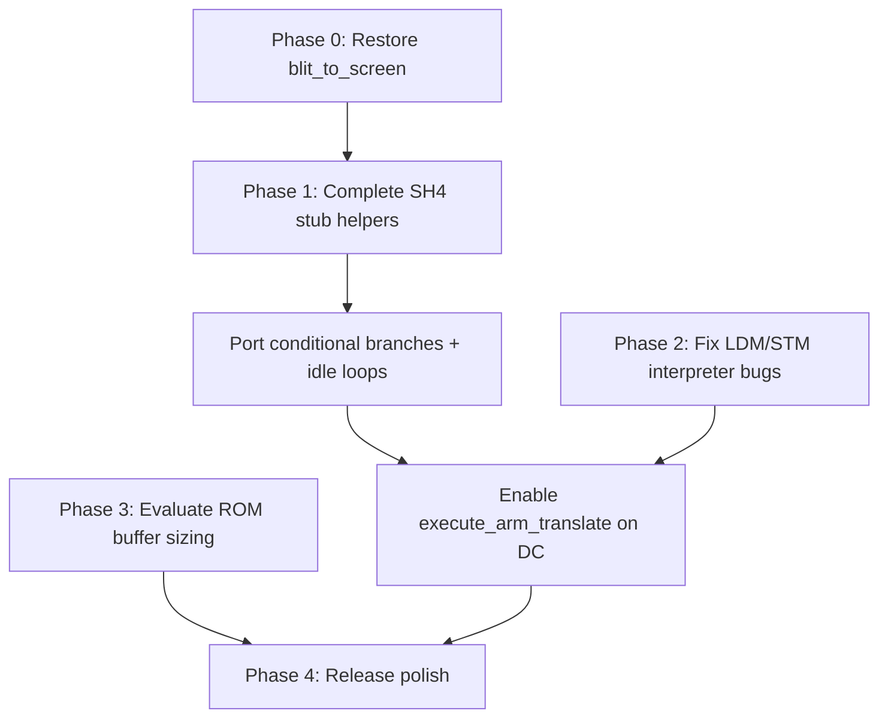

# High Impact Fixes — gPSP Dreamcast Port

Analysis of the highest-impact fixes for the **gPSPDC** Dreamcast port (`dreamcast` branch).

---

## Phase 0 — Restore `blit_to_screen()` (P0)

**Status:** Complete

`blit_to_screen()` in `video.c` was emptied when the SQ-optimized implementation was commented out. `gui.c` still calls it for savestate snapshot thumbnails (`blit_to_screen(snapshot_buffer, 240, 160, 230, 40)`).

- Main gameplay rendering via `SDL_Flip()` is unaffected.
- Menu overlays and savestate previews are broken without this function.

**Fix:** Restore the Dreamcast SQ blit path (from commit `a13177f`), with a simple memcpy fallback for non-Dreamcast builds.

---

## Phase 1 — Complete SH-4 dynarec (P1)

**Status:** Complete (audited)

Dreamcast uses `execute_arm_translate()` via the SH-4 dynarec backend.

| Area | Status |
|------|--------|
| Load/store helpers | In `dc/sh4_helpers.c` and `dc/sh4_stub.c` (SMC-aware stores) |
| CPSR/SPSR/SWI | In `dc/sh4_helpers.c` |
| Conditional branches + idle loops | In `dc/sh4_emit.h` |
| Block memory (dynarec) | Full macros via `dc/sh4_instr.inc` (x86 port) |
| `generate_update_pc_reg` | Fixed to pass `pc` into `sh4_update_gba`; added to MIPS emit |

**Audit polish (Phase 1):**

- `generate_update_pc_reg()` passes PC correctly on SH-4 and MIPS
- `execute_swi()` return type corrected to `void`
- Removed noisy Dreamcast config/cheat debug `printf`s from `memory.c`

**Remaining risks:** hardware validation on real Dreamcast; dynarec edge cases may still need game-specific testing.

---

## Phase 2 — CPU core LDM/STM fixes (P2)

**Status:** Complete

Fixed ARM `LDM`/`STM` in the interpreter (`cpu.c`):

1. **Writeback timing** — base register writeback now runs *after* the transfer loop, so `STM` with the base in the register list stores the original value before applying the final address.
2. **Load writeback** — when the base is in the list, the loaded value is kept (writeback skipped), matching ARM7TDMI behavior.
3. **User bank (`^` suffix)** — `LDM`/`STM` with the `s_bit` flag now access `reg_mode[MODE_USER][8–14]` for R8–R14 when in a privileged CPU mode.

Affects games using privileged-mode register bank switching or `STM`/`LDM` with writeback when the base register is included in the transfer list.

---

## Phase 3 — Memory limits on Dreamcast (P3)

**Status:** Not started

Dreamcast is capped at **8 MB** ROM buffer with **8 KB** pages vs **32 MB / 32 KB** on other platforms (`memory.c`).

**Impact:** Blocks larger ROMs; increases swap churn for mid-size games.

---

## Phase 4 — Release polish (P4)

**Status:** Not started

- Remove debug `printf` calls in `sh4_stub.c`, `memory.c`, and `main.c`.
- Cheats: hook routines (opcode `0x0F`) and Gameshark v3 handling incomplete in `cheats.c`.
- Video scaling path in `flip_screen()` is commented out; DC uses fixed 240×160 via SDL textured mode.

---

## Priority summary

| Phase | Fix | Effort | Impact |
|-------|-----|--------|--------|
| **0** | Restore `blit_to_screen` | Small | Fixes visible menu/savestate UI |
| **1** | Complete SH-4 dynarec stub + emit | Large | Full-speed play; idle-loop games |
| **2** | LDM/STM interpreter fixes | Medium | Compatibility for edge-case games ✓ |
| **3** | ROM buffer / paging strategy | Medium | Large ROM support |
| **4** | Remove debug prints | Trivial | Polish |

---

## Already addressed (recent commits)

- Cheat code loading from `/cd/gbaDC/`
- Config filename path for Dreamcast
- Double buffering for video mode
- Menu resolution fix
