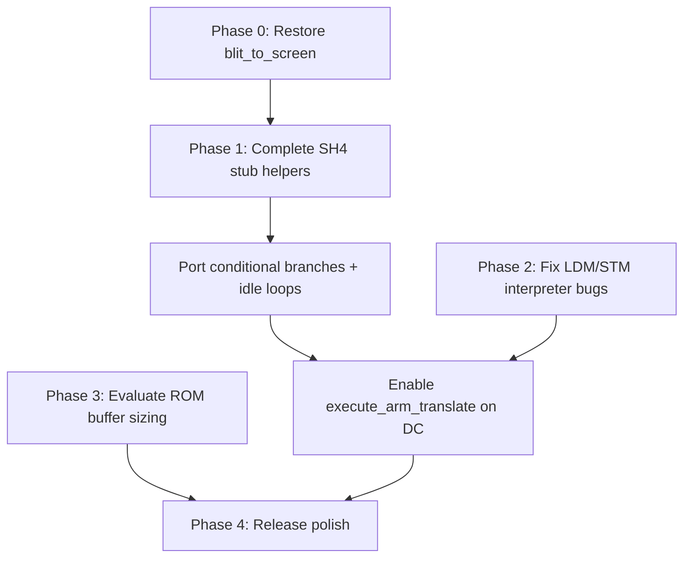

# High Impact Fixes — gPSP Dreamcast Port

Analysis of the highest-impact fixes for the **gPSPDC** Dreamcast port (`dreamcast` branch).

---

## Phase 0 — Restore `blit_to_screen()` (P0)

**Status:** Complete

`blit_to_screen()` in `video.c` was emptied when the SQ-optimized implementation was commented out. `gui.c` still calls it for savestate snapshot thumbnails (`blit_to_screen(snapshot_buffer, 240, 160, 230, 40)`).

- Main gameplay rendering via `SDL_Flip()` is unaffected.
- Menu overlays and savestate previews are broken without this function.

**Fix:** Restore the Dreamcast SQ blit path (from commit `a13177f`), with a simple memcpy fallback for non-Dreamcast builds.

---

## Phase 1 — Complete SH-4 dynarec (P1)

**Status:** Not started

Dreamcast runs the **interpreter**, not the dynarec:

```c
// main.c
#ifdef PSP_BUILD
  execute_arm_translate(execute_cycles);
#else
  execute_arm(execute_cycles);  // Dreamcast path
#endif
```

The SH-4 dynarec (`dc/sh4_emit.h`, `dc/sh4_stub.c`) is an initial scaffold (~554 lines vs ~2300+ on PSP MIPS).

| Area | Status |
|------|--------|
| Load helpers (`sh4_execute_load_u8/u16/u32/s8/s16`) | Declared in `sh4_emit.h`, not implemented in `sh4_stub.c` |
| CPSR/SPSR/SWI (`sh4_execute_read_cpsr`, `sh4_execute_swi`, etc.) | Declared, not implemented |
| Conditional branches | `arm_conditional_block_header()` and `thumb_conditional_branch` are placeholders |
| Block memory (LDM/STM) | Macro only does a single u32 access |
| Idle-loop elimination | Present in MIPS/x86 emitters, missing from SH-4 |
| Block prologue | Empty — no register setup before translated blocks |

**Impact:** Without dynarec, games with idle loops (most entries in `game_config.txt`) burn CPU spinning. PSP gets idle-loop elimination via dynarec; Dreamcast does not.

**Path forward:**

1. Finish `sh4_stub.c` (loads, CPSR, SWI, aligned access).
2. Port conditional-branch and idle-loop macros from `psp/mips_emit.h`.
3. Re-enable `execute_arm_translate()` once blocks execute correctly.

---

## Phase 2 — CPU core LDM/STM fixes (P2)

**Status:** Not started

Marked as important in `cpu.c`:

```
// Important todo:
// - stm reglist writeback when base is in the list needs adjustment
// - block memory needs psr swapping and user mode reg swapping
```

Affects games using complex `LDM`/`STM` in user mode or with writeback edge cases. Worth fixing in the interpreter even before dynarec is complete.

---

## Phase 3 — Memory limits on Dreamcast (P3)

**Status:** Not started

Dreamcast is capped at **8 MB** ROM buffer with **8 KB** pages vs **32 MB / 32 KB** on other platforms (`memory.c`).

**Impact:** Blocks larger ROMs; increases swap churn for mid-size games.

---

## Phase 4 — Release polish (P4)

**Status:** Not started

- Remove debug `printf` calls in `sh4_stub.c`, `memory.c`, and `main.c`.
- Cheats: hook routines (opcode `0x0F`) and Gameshark v3 handling incomplete in `cheats.c`.
- Video scaling path in `flip_screen()` is commented out; DC uses fixed 240×160 via SDL textured mode.

---

## Priority summary

| Phase | Fix | Effort | Impact |
|-------|-----|--------|--------|
| **0** | Restore `blit_to_screen` | Small | Fixes visible menu/savestate UI |
| **1** | Complete SH-4 dynarec stub + emit | Large | Full-speed play; idle-loop games |
| **2** | LDM/STM interpreter fixes | Medium | Compatibility for edge-case games |
| **3** | ROM buffer / paging strategy | Medium | Large ROM support |
| **4** | Remove debug prints | Trivial | Polish |



---

## Already addressed (recent commits)

- Cheat code loading from `/cd/gbaDC/`
- Config filename path for Dreamcast
- Double buffering for video mode
- Menu resolution fix
