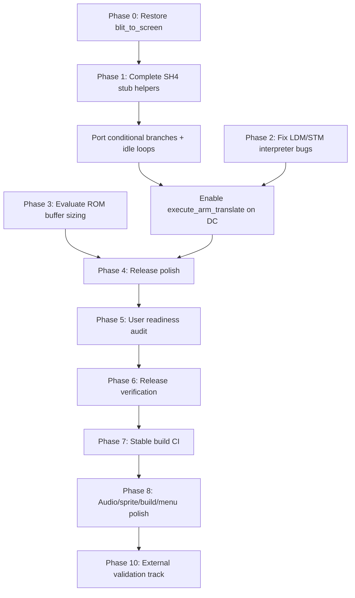

# High Impact Fixes — gPSP Dreamcast Port

Analysis of the highest-impact fixes for the **gPSPDC** Dreamcast port (`dreamcast` branch).

---

## Phase 0 — Restore `blit_to_screen()` (P0)

**Status:** Complete

`blit_to_screen()` in `video.c` was emptied when the SQ-optimized implementation was commented out. `gui.c` still calls it for savestate snapshot thumbnails (`blit_to_screen(snapshot_buffer, 240, 160, 230, 40)`).

- Main gameplay rendering via `SDL_Flip()` is unaffected.
- Menu overlays and savestate previews are broken without this function.

**Fix:** Restore the Dreamcast SQ blit path (from commit `a13177f`), with a simple memcpy fallback for non-Dreamcast builds.

---

## Phase 1 — Complete SH-4 dynarec (P1)

**Status:** Complete (audited and polished — Phase 1–7 audit pass)

Dreamcast uses `execute_arm_translate()` via the SH-4 dynarec backend.

| Area | Status |
|------|--------|
| Load/store helpers | In `dc/sh4_helpers.c` and `dc/sh4_stub.c` (SMC-aware stores) |
| CPSR/SPSR/SWI | In `dc/sh4_helpers.c` |
| Conditional branches + idle loops | In `dc/sh4_emit.h` |
| Block memory (dynarec) | Full macros via `dc/sh4_instr.inc` (x86 port) |
| `generate_update_pc_reg` | Passes `pc`, reloads cycle counter from `sh4_update_gba` return |

**Audit polish (Phase 1):**

- Extended `SH4_EMIT_LOAD/STORE_REG` for `reg[16+]` (flags, CPSR) via indexed addressing
- Fixed conditional branch patch (`generate_branch_patch_conditional`) and relative offset (`+4` delay slot)
- `sh4_update_gba` tail-jumps on IRQ/PC change; emitted code reloads `r13` from return value
- `execute_store_*` takes instruction PC (third arg) instead of corrupting `REG_PC` with the address
- Added `get_shift_imm` / `generate_shift_reg`; Thumb hi-reg PC branches move target into `r4`
- Audited SH-4 opcode emission for ALU ops, load/store displacement, shifts/rotates, `jsr`, `cmp/eq`, and unsigned immediate materialization
- Async exits from `sh4_update_gba` and store-alert helpers reload the live SH-4 `r13` cycle budget before block re-entry
- Post-compile icache invalidation now covers the active RAM/ROM/BIOS translation cache instead of always flushing the RAM cache span
- `SH4_EMIT_CMP_REG` uses `cmp/eq` (sets T flag); `swi_hle_div` remainder fix
- Host tests: `tests/phase1_helpers_test.c`, `tests/sh4_emit_encoding_test.c`, `tests/sh4_integration_contract_test.c`
- **Phase 1–7 audit polish:** dynarec LDM/STM now delegates to `execute_arm_block_memory()` in `dc/sh4_helpers.c` (matches Phase 2 interpreter semantics, including user bank and writeback timing); fixed duplicate `arm_psr_store_finish` macro shadowing so CPSR stores emit `execute_store_cpsr` + IRQ postamble

**Remaining risks:** hardware validation on real Dreamcast/KOS toolchain; dynarec edge cases may still need game-specific testing.

---

## Phase 2 — CPU core LDM/STM fixes (P2)

**Status:** Complete (interpreter + Dreamcast dynarec)

Fixed ARM `LDM`/`STM` in the interpreter (`cpu.c`) and the Dreamcast dynarec path (`execute_arm_block_memory()` via `dc/sh4_instr.inc`):

1. **Writeback timing** — base register writeback now runs *after* the transfer loop, so `STM` with the base in the register list stores the original value before applying the final address.
2. **Load writeback** — when the base is in the list, the loaded value is kept (writeback skipped), matching ARM7TDMI behavior.
3. **User bank (`^` suffix)** — `LDM`/`STM` with the `s_bit` flag now access `reg_mode[MODE_USER][8–14]` for R8–R14 when in a privileged CPU mode.

Affects games using privileged-mode register bank switching or `STM`/`LDM` with writeback when the base register is included in the transfer list.

- **Host tests:** `tests/phase2_ldm_stm_test.c` contract-checks interpreter and dynarec LDM/STM paths

---

## Phase 3 — Memory limits on Dreamcast (P3)

**Status:** Complete

Unified gamepak swap paging in `memory.c`:

- **32 KB pages everywhere** — `GAMEPAK_SWAP_PAGE_SIZE` used for buffer page count, `load_gamepak_page()`, and `evict_gamepak_page()` (fixes prior 8 KB / 32 KB mismatch on Dreamcast).
- **Dreamcast ROM buffer** — tries **16 MB**, then **12 / 8 / 4 MB** on `malloc` failure (was a fixed 8 MB with wrong page math).
- **Graceful failure** — `init_gamepak_buffer()` returns early if allocation fails instead of dereferencing NULL; `gamepak_memory_map` allocation failure now frees the ROM buffer instead of leaving a dangling pointer.

**Impact:** Larger ROMs can stay resident longer on DC; swapped ROM paging is consistent across platforms.

- **Host tests:** `tests/phase3_memory_test.c` contract-checks page size, DC buffer tiers, and NULL guards

---

## Phase 4 — Release polish (P4)

**Status:** Complete

- **Debug output** — startup and DMA trace `printf` calls in `main.c`, `memory.c`, and `video.c` now route through `gpsp_debug_printf()` (silent unless built with `-DGPSP_DEBUG`). User-facing errors (missing BIOS, failed ROM load) are unchanged.
- **Cheats** — fixed Gameshark v3 I/O register opcode extraction (`(address >> 24) & 0x0F`); added ROM patch (opcode `0x6`), button-gated writes (`0x8`), hook/master address tracking (`0x0F` and `0x001DC0DE` lines). Gameshark v1 IF codes (`0xD`/`0xE`) and PAR v3 conditionals are supported via an Action Replay engine adapted from [SkyEmu](https://github.com/skylersaleh/SkyEmu) (MIT): nested IF/ELSE/ENDIF stacks, ROM patches, fill codes, and button-gated multi-line writes. PAR v3 slowdown (`00000000 0800xx00`) re-runs the cheat list `xx` times per cycle. `DEADFACE` re-encryption lines reseed decryption during cheat load (mGBA algorithm/tables, MPL 2.0). Up to eight master hooks are tracked; dynarec emits `process_cheats()` at any hook PC via `cheat_pc_is_hook()` and flushes translation caches when hooks change. See `THIRD_PARTY_NOTICES.md`.
- **CPSR store** — `execute_store_cpsr()` in `dc/sh4_helpers.c` returns the IRQ vector when enabling interrupts unmasks a pending IRQ; dynarec emission branches via `arm_psr_store_cpsr_post()`. `execute_spsr_restore()` uses the same `sh4_take_pending_irq()` helper so MOVS PC returns through the vector instead of leaving IRQ state half-applied.
- **Video scaling** — GBA framebuffer stays at native 240×160 (`video_scale = 1`); Dreamcast presents through a 512×512 SDL texture (`video_resolution_large()`). Menu scaling options affect window placement, not framebuffer upscale.
- **Host tests** — `tests/phase4_cheats_test.c` covers GS3 opcode extraction, master-hook address math, and `cheats.c` / dynarec hook source contracts
- **Debug keys** — F3 translation-cache dump gated behind `GPSP_DEBUG` (matches F2 palette dump gating)

---

## Phase 5 — User readiness audit (P5)

**Status:** Complete

- **On-screen fatal errors (Dreamcast)** — missing BIOS, ROM buffer allocation failure, and gamepak load errors now show a readable message on the display (with serial `printf` fallback) and wait for Start before exiting. BIOS screen includes `/cd/gba_bios.bin` path, size, and MD5.
- **ROM load error fix** — command-line load path now reports `argv[1]` instead of an uninitialized `load_filename`.
- **README** — savestate filenames corrected to `<romname>.0.svs` … `<romname>.9.svs` (matches `gui.c`).
- **Debug keys** — host SDL F2 palette dump gated behind `GPSP_DEBUG` (silent in release builds).
- **Host tests** — `tests/phase5_user_readiness_test.c` contract-checks fatal-error strings, README savestate docs, ROM/ZIP safety, and debug-key gating
- **Smoke test** — `HARDWARE_SMOKE_TEST.md` rows 14–15 cover ROM-buffer and dynarec fatal-error screens

**Remaining risks:** real-hardware smoke test on Dreamcast; no automated on-target UI test.

---

## Phase 6 — Release verification (P6)

**Status:** Complete

- **Version string** — `GPSPDC_VERSION` (`0.9.1-dc`) in `common.h`; shown on the empty-ROM menu splash.
- **Menu load errors (Dreamcast)** — failed in-menu ROM loads now call `gpsp_gamepak_load_error()` instead of silently exiting via `quit()`.
- **Hardware smoke test** — `HARDWARE_SMOKE_TEST.md` documents boot, fatal-error, gameplay, savestate, cheat, and large-ROM checks for Dreamcast/Flycast.
- **CI** — `.github/workflows/tests.yml` and `.github/workflows/dreamcast-build.yml` both run `make -C tests test` on push/PR to `dreamcast` (Dreamcast workflow also cross-compiles via `./scripts/dc-build.sh`).
- **Host tests** — `tests/phase6_release_verification_test.c` contract-checks exact `GPSPDC_VERSION`, menu error path, smoke-test doc, and both CI workflows.

**Remaining risks:** manual hardware/Flycast execution of the smoke-test checklist.

---

## Phase 7 — Stable build (P7)

**Status:** Complete

- **KOS cross-compile CI** — `.github/workflows/dreamcast-build.yml` cross-compiles `gdC.elf` in `einsteinx2/dcdev-kos-toolchain:gcc-9__v2.0.0` on push/PR to `dreamcast`.
- **Romdisk placeholder** — `dc/romdisk/` ensures KOS `genromfs` has a source directory in fresh checkouts.
- **Docker build helper** — `scripts/dc-build.sh` wraps the same pinned container image for local stable builds.
- **CDI packaging** — `dc/dc.sh` preflights `gdC.elf`, `gba_bios.bin`, and KOS tools; syncs `game_config.txt` via `scripts/sync-game-config.sh` before `mkdcdisc`.
- **Host tests** — `tests/dc_build_contract_test.c` contract-checks Dreamcast source paths, romdisk layout, CI workflow, and game-config sync

**Remaining risks:** manual hardware/Flycast execution of the smoke-test checklist; CDI packaging still requires local KOS tools and user-supplied BIOS.

---

## Phase 8 — Audio, sprite, build, and menu polish (P8)

**Status:** Complete (audited and polished — Phase 8 audit pass)

### Audio
- **`sound_reset_fifo()`** — resets the requested Direct Sound channel (A or B), not always channel 0
- **Audio buffer config** — Dreamcast honors `audio_buffer_size_number` from `gpsp.cfg` / menu
- **`SDL_OpenAudio()` errors** — fatal on-screen error on Dreamcast when audio init fails
- **Audio-off wrap bug** — ring-buffer wrap uses `sound_copy_null` when output is disabled
- **Audio audit polish:** `sound_reset_fifo()` clears FIFO indices; `reset_sound()` zeroes the full ring buffer; audio mutex/cond created before `SDL_OpenAudio()`; `sound_initialized` guards menu/debug pause and mix paths when init fails; removed dead `enable_low_pass_filter` / `synchronize_sound()` / unused PSP audio headers; fixed duplicate envelope assignment in tone control macro; menu help text no longer references nonexistent audio filtering

### Sprites / video
- **`copy_screen()`** — pitch-aware row copy (fixes menu backgrounds and savestate previews)
- **Frameskip + affine** — affine BG/OBJ reference updates run even when rendering is skipped
- **OBJ priority list** — bounds check before inserting into the 128-entry per-scanline list
- **`blit_to_screen()`** — pitch-aware copy helper; `-DGPSP_DC_BLIT_MEMCPY` enabled by default in `dc/Makefile` for safe memcpy blits (SQ path available when undefined)

### Build stability
- **`dc/Makefile`** — `VPATH` keeps object files under `dc/` (no root `.o` collisions)
- **Incremental builds** — removed `rm-elf` from default `all` target
- **Pinned Docker image** — `gcc-9__v2.0.0` in `scripts/dc-build.sh`
- **CI** — host contract tests + `./scripts/dc-build.sh` in Dreamcast workflow
- **`.gitignore`** — ignores build artifacts

### Menu performance
- **Input pacing** — removed fixed 30 ms sleep on Dreamcast menu input
- **Vblank** — `SDL_DC_VerticalWait(SDL_FALSE)` so `SDL_Flip` does not block
- **Dirty redraw** — menu and ROM browser repaint only when changed
- **Video mode** — Dreamcast stays at 512×512 for gameplay and menu (no `SDL_SetVideoMode` hitches)
- **Savestate previews** — deferred CD reads; slot sync on main menu without thumbnail reload

- **Host tests** — `tests/phase8_dreamcast_polish_test.c` contract-checks audio, video, menu, and build polish
- **Phase 8 audit polish:** root `Makefile` delegates to `x86/`; cheat master hooks validated to ROM/EWRAM/IWRAM; fatal-error strings use bounded `snprintf`; README documents VRAM SMC and host build path

**Remaining risks:** hardware validation of menu feel and audio buffer tuning on real hardware/Flycast.

---

## Priority summary

| Phase | Fix | Effort | Impact |
|-------|-----|--------|--------|
| **0** | Restore `blit_to_screen` | Small | Fixes visible menu/savestate UI |
| **1** | Complete SH-4 dynarec stub + emit | Large | Full-speed play; idle-loop games |
| **2** | LDM/STM interpreter fixes | Medium | Compatibility for edge-case games ✓ |
| **3** | ROM buffer / paging strategy | Medium | Large ROM support ✓ |
| **4** | Release polish | Small | Cleaner release build ✓ |
| **5** | User readiness audit | Small | On-screen errors, docs, debug gating ✓ |
| **6** | Release verification | Small | Version, smoke-test doc, CI, menu errors ✓ |
| **7** | Stable build | Small | KOS cross-compile CI, romdisk, docker helper ✓ |
| **8** | Audio/sprite/build/menu polish | Small | Correctness, build hygiene, menu responsiveness ✓ |
| **10** | External validation track | Medium | MIT regression packs, CPU parity tests, ZIP/UI dependency audits |

---

## Phase 10 — External validation track (P0–P4)

**Status:** Planned / scaffolded

- **P0:** `jsmolka/gba-tests` plus `SingleStepTests/ARM7TDMI` for CPU, memory, save, BIOS, PPU, and interpreter/dynarec parity checks
- **P1:** `miniz` vendored as an optional ZIP inflate backend behind `USE_MINIZ=1`, for lower-heap experiments before replacing the default zlib path
- **P2:** `stb_easy_font` / `stb_image_resize` only if menu/error readability or asset scaling needs a tiny dependency
- **P3:** `SkyEmu`, `rustboyadvance-ng`, and `gba-kit` as read-only references for hard-game, backup-media, bus, DMA, and timer audits
- **P4:** KOS / `mkdcdisc` pinning notes for easier contributor builds

See [EXTERNAL_VALIDATION.md](EXTERNAL_VALIDATION.md) and run `sh scripts/fetch-external-validation.sh`.

---

## Already addressed (recent commits)

- Cheat code loading from `/cd/gbaDC/`
- Config filename path for Dreamcast
- Double buffering for video mode
- Menu resolution fix
- Audio/sprite correctness fixes (Direct Sound FIFO, pitch-aware snapshots, frameskip affine)
- Build stability (VPATH, pinned Docker image, CI consolidation)
- Menu responsiveness (dirty redraw, deferred savestate previews, no video mode switching on DC)
- Phase 1–7 dynarec LDM/STM, CPSR macro, memory-map guard, and expanded contract tests
- Phase 8 audit: host Makefile, cheat hook bounds, bounded fatal-error strings
